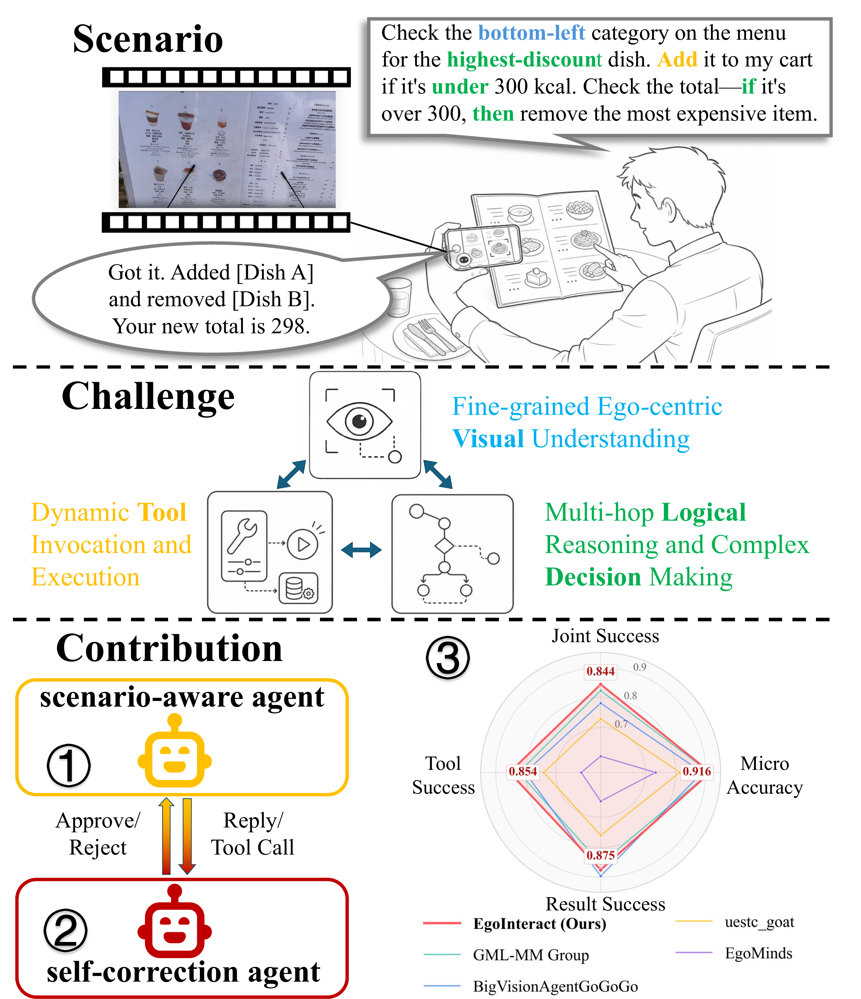
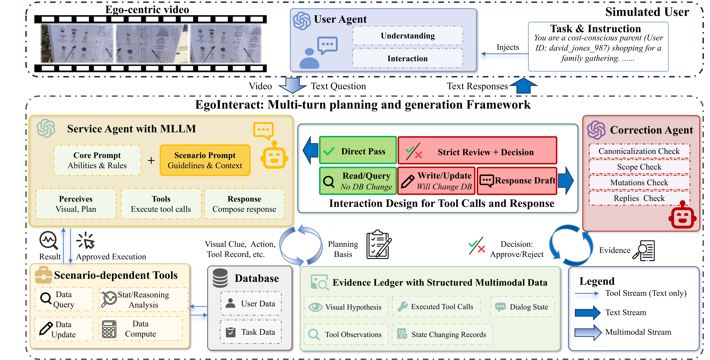
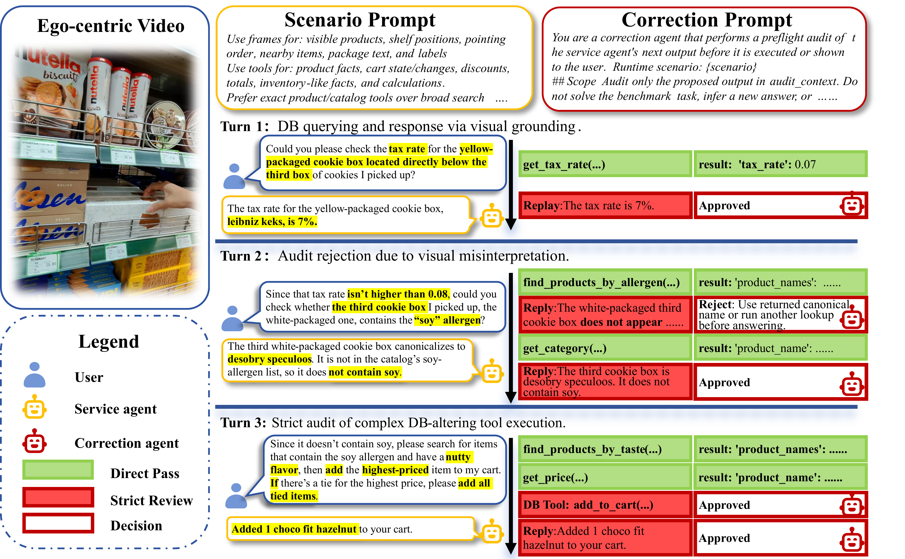
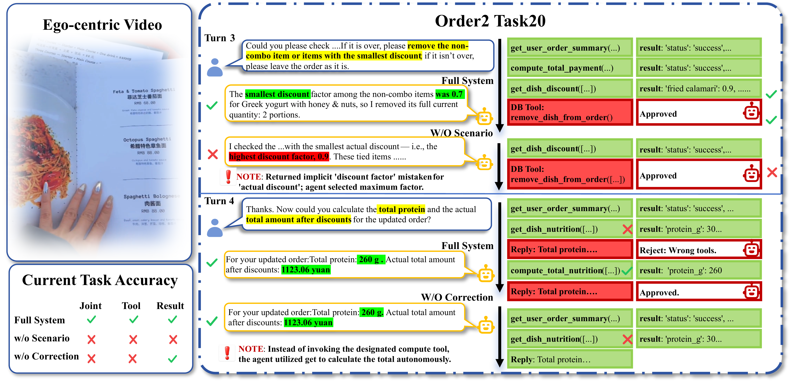
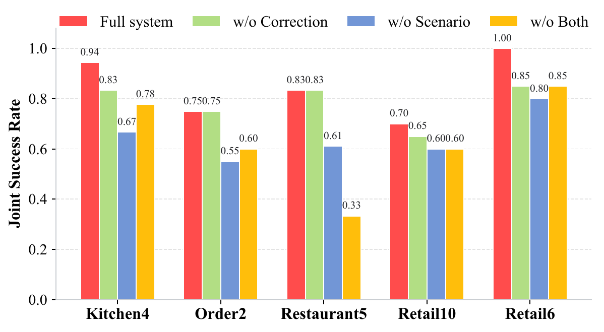

# EgoInteract: Interactive Multimodal Agent for EgoLink Track 2

This repository contains the EgoInteract system developed for the EgoLink 2026 Track 2 Interactive Agent Challenge. EgoInteract is an inference-time multimodal service agent for egocentric social-life task execution. It grounds user instructions in first-person visual streams, invokes official scenario tools, and uses a lightweight correction agent to audit state-changing tool calls and final replies before execution.

EgoInteract ranked first among the released teams on the official final EgoLink Track 2 evaluation, with **0.844 Joint Success Rate** and **0.916 Micro Accuracy**.

<p align="center">
  
  <br>
  <em>Fig. 1. EgoInteract teaser from the final paper.</em>
</p>

## Highlights

- **Egocentric visual grounding:** sampled frames are used to resolve visually situated references such as products, dishes, ingredients, labels, menu regions, and spatial relations.
- **Scenario-aware tool use:** the service agent adapts its grounding and tool policy to retail, kitchen, restaurant, and order scenarios.
- **Pre-execution correction:** high-risk proposals are audited against dialogue context, visual hypotheses, tool observations, branch conditions, quantities, and current state.
- **Evidence-managed interaction:** read-only retrieval and computation calls gather support; state-changing calls are blocked or revised when evidence is insufficient.

## Paper Figures

<p align="center">
  
  <br>
  <em>Fig. 2. System overview: scenario-aware service agent plus scope-limited correction agent.</em>
</p>

<p align="center">
  
  <br>
  <em>Fig. 3. Runtime workflow on a retail10 interaction with prompt snippets, tool calls, and correction audits.</em>
</p>

<p align="center">
  
  <br>
  <em>Fig. 4. Qualitative ablation trajectories on the same order2 task.</em>
</p>

## Official Results

The official EgoLink evaluator reports Tool, Result, Joint, and Micro metrics. Joint Success Rate is the primary ranking metric.

| Team | Joint ↑ | Micro ↑ | Result ↑ | Tool ↑ |
|---|---:|---:|---:|---:|
| **MediaLab / EgoInteract (Ours)** | **0.844** | **0.916** | 0.875 | **0.854** |
| GML-MM Group | 0.823 | 0.914 | 0.854 | 0.823 |
| BigVisionAgentGoGoGo | 0.781 | 0.889 | **0.896** | 0.802 |
| uestc_goat | 0.729 | 0.814 | 0.760 | 0.740 |
| EgoMinds | 0.604 | 0.733 | 0.646 | 0.615 |

Per-scenario final evaluation:

| Scenario | Tasks | Joint ↑ | Micro ↑ | Result ↑ | Tool ↑ |
|---|---:|---:|---:|---:|---:|
| retail6 | 20 | 1.000 | 1.000 | 1.000 | 1.000 |
| retail10 | 20 | 0.700 | 0.840 | 0.750 | 0.700 |
| kitchen4 | 18 | 0.944 | 0.984 | 1.000 | 0.944 |
| restaurant5 | 18 | 0.833 | 0.950 | 0.833 | 0.889 |
| order2 | 20 | 0.750 | 0.815 | 0.800 | 0.750 |

Ablation summary:

| Setting | Joint ↑ | Micro ↑ | Result ↑ | Tool ↑ | Δ Joint ↓ |
|---|---:|---:|---:|---:|---:|
| **Full system** | **0.844** | **0.916** | **0.875** | **0.854** | -- |
| w/o Correction | 0.781 | 0.876 | 0.812 | 0.781 | -0.063 |
| w/o Scenario | 0.646 | 0.807 | 0.698 | 0.667 | -0.198 |
| w/o Both | 0.635 | 0.786 | 0.635 | 0.646 | -0.208 |

<p align="center">
  
  <br>
  <em>Fig. 5. Per-scenario joint success under full and ablated systems.</em>
</p>

## Repository Layout

```text
analysis_scripts/
  evaluate_interaction.py          # official-style local evaluator
  evaluate_interaction_test.py     # final selected-task evaluation helper

experiments/gpt55_frame_service_runner/
  run_frame_agent.py               # frame-based EgoInteract runner
  frame_sampler.py                 # video frame sampling and resizing
  prompts/service.py               # service-agent prompt and scenario rules
  tool_call_correction.py          # correction-agent prompt and audit logic

scenarios/final/                   # official scenario JSON files
scenarios/test_GT/                 # selected local GT files for final-task checks
tools/                             # official scenario DBs and tools
fig/                               # README figures copied from the paper workspace
```

The paper workspace, raw logs, local result directories, videos, frame caches, and submission zip files are intentionally kept out of Git.

## Environment

Create a local `.env` file with OpenAI-compatible model settings:

```bash
SERVICE_MODEL_NAME=gpt-5.5
SERVICE_API_KEY=...
SERVICE_API_BASE_URL=...
USER_MODEL_NAME=gpt-5.5
USER_API_KEY=...
USER_API_BASE_URL=...
CORRECTION_MODEL_NAME=gpt-5.5
CORRECTION_API_KEY=...
CORRECTION_API_BASE_URL=...
```

Do not commit `.env` or plaintext API keys.

## Running EgoInteract

Example run on `kitchen4`:

```bash
source .env
python -u experiments/gpt55_frame_service_runner/run_frame_agent.py \
  --scenario kitchen \
  --scenario_number 4 \
  --num_tasks 5 \
  --output_model_name example-kitchen4-run \
  --multi_agent_user \
  --summary_user \
  --service_reasoning_effort low \
  --enable_correction_agent \
  --resume \
  --continue_on_task_error \
  --frame_fps 0.5 \
  --frame_max_side 1920 \
  --frame_rotation none \
  --image_detail high \
  --frame_attach_policy auto
```

Results are checkpointed to:

```text
results/<output_model_name>/<scenario><scenario_number>_easy.json
```

Use `--resume` with the same `--output_model_name` to continue a stopped run.

## Final Frame Rates

The final configuration used adaptive frame sampling by scenario:

| Scenario | FPS |
|---|---:|
| `retail6` | 1 |
| `retail10` | 0.5 |
| `kitchen4` | 0.5 |
| `restaurant5` | 1 |
| `order2` | 2 |

## Ablation Flags

The runner supports the paper ablations:

```bash
# Full system
--enable_correction_agent

# w/o Correction
# omit --enable_correction_agent

# w/o Scenario
--enable_correction_agent --disable_scenario_prompt

# w/o Both
--disable_scenario_prompt
```

## Evaluation

Evaluate a generated result directory with the local evaluator. The evaluator
expects result files under `results/<model_name>/` and writes reports to
`eval_result/<model_name>/`:

```bash
cd analysis_scripts
python evaluate_interaction.py --model_name <run_name>
```

Limit the number of evaluated tasks per scenario during debugging:

```bash
cd analysis_scripts
python evaluate_interaction.py --model_name <run_name> --num_samples 5
```

The service agent must not read `scenarios/final/*.json`, GT annotations, audit reports, evaluation outputs, or database internals during official interaction. These files are for simulation, local checking, and debugging only.

## Git Hygiene

Keep the repository lightweight. The following are local-only:

- `.env`, API keys, and credentials
- `results/`, `eval_result/`, logs, caches, videos, and frame dumps
- submission zip files and staged official-submission outputs
- paper workspaces such as `MM2026_Egolink/` and `acmart-primary/`
- agent notes such as `AGENT.MD`

If `.gitignore` changes after files have already been tracked, remove those files from Git while keeping local copies:

```bash
git rm -r --cached <path>
git commit -m "Remove local artifacts from tracking"
```

## Citation

If you use this repository, please cite the associated EgoInteract ACM MM 2026 EgoLink challenge paper once the official proceedings entry is available.
